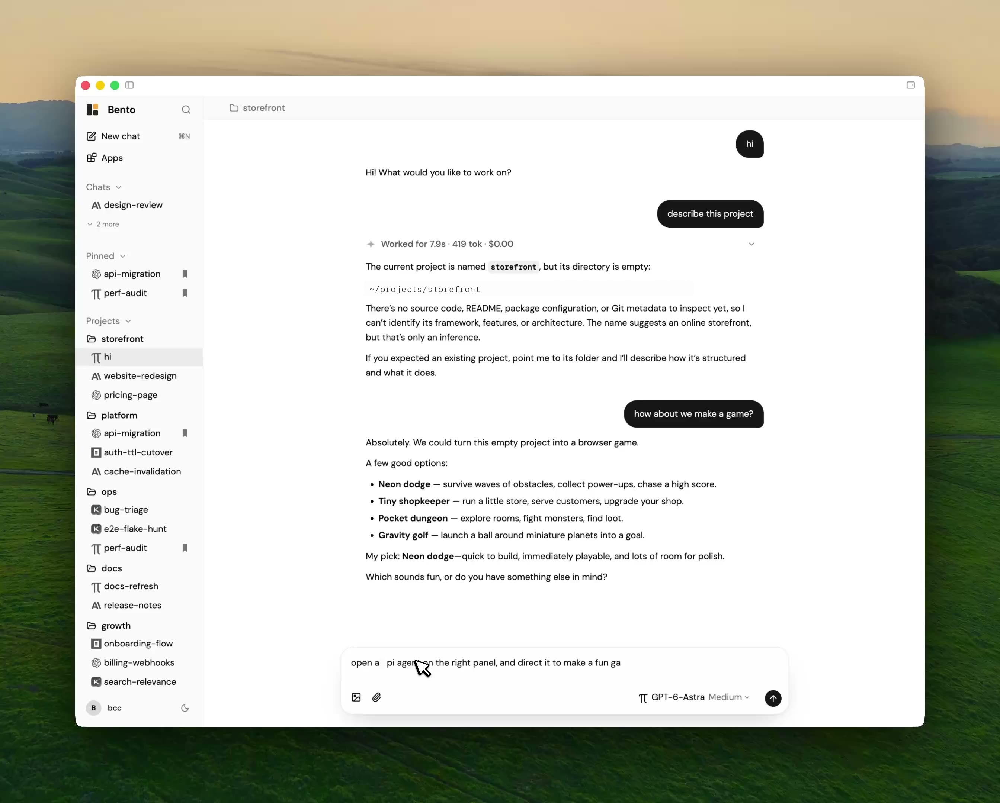

<p align="center">
  
</p>

<h1 align="center">Bento</h1>

<p align="center"><strong>你的自由 Agent 工作空间。</strong></p>

<p align="center">
  在一个本地优先的桌面工作台里运行多种 Coding Agent、模型与项目。
</p>

<p align="center">
  <a href="https://bento-ai.app">官网</a> ·
  <a href="https://github.com/billc8128/bento/releases/latest">下载</a> ·
  <a href="README.md">English</a>
</p>

<p align="center">
  <a href="https://github.com/billc8128/bento/releases/latest"></a>
  
  
  <a href="LICENSE"></a>
</p>

<p align="center">
  
</p>

> [!NOTE]
> Bento 仍在快速迭代。当前版本为 **v0.4.1**，仅提供 **Apple 芯片 Mac**
> 版本；产品形态与扩展契约仍可能调整。

## 为什么是 Bento？

Agent 很强，但它们的会话、模型、权限和项目上下文往往散落在不同终端中。Bento 把这些工作收进同一个桌面，同时保留你已经在使用的 Harness。

- **一个工作台，多种 Harness**：在 Pi、Codex、Claude Code、Kimi Code、OpenCode、OMP、Hermes 与 Trae Code 之间切换。
- **真正的多 Agent 工作**：并排打开多个 Agent，并在会话和项目之间委派任务。
- **使用自己的模型与 Provider**：发现本地凭证、连接受支持的 Provider、选择模型，并把推理配置真实传给底层 Harness。
- **工作区工具集中呈现**：聊天、终端、文件、预览与浏览器共用同一套桌面布局。
- **本地优先的数据**：会话、历史、布局、设置与 Provider 配置保存在本机。
- **可以塑造的工作空间**：自由分栏和调整面板、恢复布局，并选择多套完整视觉主题。

## 支持的 Harness

| Harness | 接入方式 |
| --- | --- |
| Pi | 内置 RPC Runtime |
| Codex | 原生 `app-server` Driver |
| Claude Code | 内置 Claude Agent SDK Runtime |
| Kimi Code | Agent Client Protocol（ACP） |
| OpenCode | Agent Client Protocol（ACP） |
| OMP | Agent Client Protocol（ACP） |
| Hermes | Agent Client Protocol（ACP） |
| Trae Code | Agent Client Protocol（ACP） |

模型行为与登录状态仍由各 Harness 负责。对于受支持的运行时，Bento 会内置或按固定版本下载，并在使用前校验下载产物。

## 安装

[下载 Bento v0.4.1 macOS 版（Apple 芯片）](https://github.com/billc8128/bento/releases/latest/download/Bento-0.4.1-arm64.dmg)，打开 DMG，然后把 Bento 移入“应用程序”。

首次启动后：

1. 创建普通对话，或选择一个项目目录。
2. 选择 Harness。
3. 使用 Harness 已有登录态，或在 Bento 中配置 Provider。
4. 选择模型并开始工作。

部分 Harness 和 Provider 需要单独的账号、订阅、API Key 或网络连接。Bento 本身不提供模型推理服务。

## 从源码运行

要求：**Node.js 24+**、**pnpm 10**；当前桌面构建目标还要求 Apple 芯片 Mac。

```bash
pnpm install
pnpm dev
```

常用命令：

```bash
pnpm dev:web   # 仅浏览器 UI 预览
pnpm test      # 运行测试
pnpm lint      # 静态检查
pnpm build     # 构建应用
pnpm dist:dir  # 生成 release/mac-arm64/Bento.app
pnpm dist      # 生成 arm64 DMG
```

## 工作原理

Bento 是一个使用 React Renderer 的 Electron 应用。不同 Harness 被适配到统一的 Driver 与事件契约，因此实时输出和本地历史可以共用同一条渲染路径。Main Process 负责 Harness Runtime、Provider 路由、本地持久化、权限与工作区工具；Renderer 负责界面和布局。

```text
React 工作台
    │
Electron Main Process
    │
统一 Harness Driver + 事件契约
    │
Pi · Codex · Claude Code · Kimi · OpenCode · OMP · Hermes · Trae
```

“本地优先”不等于完全离线：Prompt 与工具调用仍可能发送给你通过 Harness 选择的模型 Provider。

## 参与贡献

欢迎提交 Issue 和 Pull Request。若要修改重要产品行为或架构，请先创建 Issue 对齐方向，避免实现完成后才发现目标不同。

提交 Pull Request 前请运行：

```bash
pnpm test
pnpm lint
pnpm build
```

请保持改动聚焦，遵守现有会话与 Provider 契约，不要提交凭证或私人会话数据。

## License

Bento 基于 [MIT License](LICENSE) 开源。
